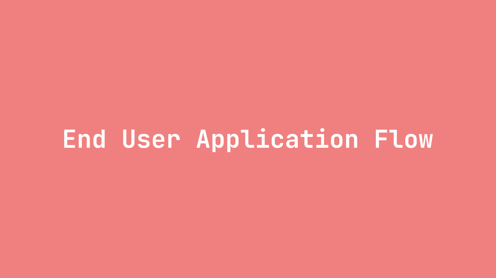

# Generic AWS Diagram

This diagram outlines how Motion Canvas can be used to create a reference architecture diagram.

## Usage

1. Checkout the Repo `git@github.com:gwagner/diagrams.git`
1. Navigate to this package
1. Run `npm install`
1. Run `npm start`
1. Navigate to `http://localhost:9000` in your browser

## Rendering 

1. Use all default rendering settings
1. Click the render button
1. Navigate to the root of this repo and run ./render-video.sh packages/<your_package_name>
1. This will use ffmpeg to render a packages/<your_package_name>/output/palette.png and a packages/<your_package_name/video.gif file.
1. Finally, it will use MPV to display the rendered gif!
